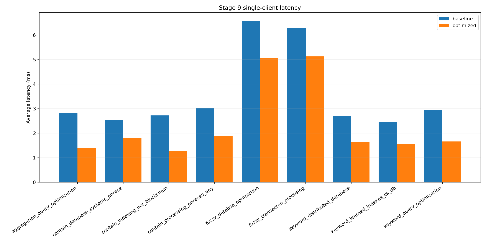
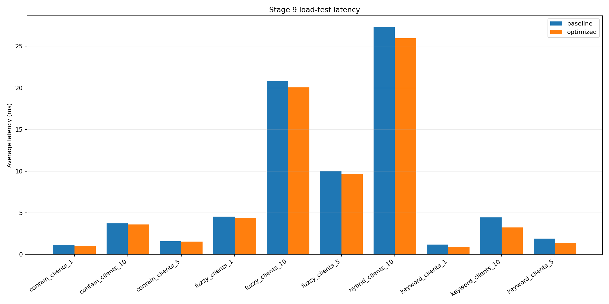

# گزارش نهایی پروژهٔ جست‌وجوی تمام‌متن arXiv

## خلاصهٔ اجرایی

این پروژه یک مسیر کامل و قابل بازتولید برای پاک‌سازی، index کردن و جست‌وجوی ۵۰٬۰۰۰ مقالهٔ arXiv با Elasticsearch 9.4.4 پیاده‌سازی می‌کند. سه روش keyword، contain و fuzzy، معماری ترکیبی weighted-RRF، سنجش کیفیت دستی، benchmark تک‌کاربره و ده سناریوی چندکاربره روی indexهای baseline و optimized اجرا شده‌اند.

تمام benchmarkهای اصلی با پروتکل ثابت و صفر خطا تمام شدند. اجرای optimized شامل 984,503 جست‌وجوی load-test بود و Precision@10 در تمام زوج‌های query/method نسبت به baseline ثابت ماند.

## داده و منشأ

منبع بالادستی: https://www.kaggle.com/datasets/Cornell-University/arxiv

فایل خام تحویلی یک نمونهٔ ۵۰هزار رکوردی است؛ seed و کد استخراج این نمونه در مخزن اولیه وجود نداشت و این محدودیت provenance صریحاً ثبت شده است.

| فایل | اندازه (بایت) | SHA-256 | تأیید |
|---|---:|---:|---:|
| dataset/arxiv_project_sample_50k.jsonl | 141586787 | `190b0a678f946338d9daa100a193e8b9ea59c56cf14157f288ee77b05cf03f84` | True |
| dataset/arxiv_project_sample_50k_cleaned.jsonl | 141586775 | `86b9febd7fc85d1b9c97377b36db525391854c134430b85e30c87a1dc18f2ad6` | True |

پاک‌سازی با خواندن خطی JSONL، Unicode NFC، حذف نویسه‌های کنترلی، تثبیت schema، استخراج year و بازسازی title_abstract انجام شد. هر ۵۰٬۰۰۰ رکورد معتبر باقی ماند.

## محیط و طراحی ذخیره‌سازی

- Python 3.11.8; Docker 28.3.2; Docker Compose 2.38.2-desktop.1; Elasticsearch 9.4.4
- محیط تک‌نودی، ۲ CPU، محدودیت حافظهٔ ۲GB و heap برابر ۱GB
- هر دو index یک shard و صفر replica دارند.
- baseline فقط analyzer استاندارد دارد؛ optimized قابلیت n-gram زیررشته و multi-fieldهای آزمایشی را جدا نگه می‌دارد.
- هر دو index اصلی با dataset و batch=500 یکسان ساخته شدند.

## جست‌وجو و معماری ترکیبی

keyword با multi_match، contain با عبارت/شرط مثبت-منفی و fuzzy با fuzziness کنترل‌شده پیاده‌سازی شده است. معماری ترکیبی ابتدا keyword و contain را موازی اجرا می‌کند و فقط در صورت کمبود candidate، نبود overlap یا سناریوی typo، fuzzy را فعال می‌کند. ادغام رتبه‌ها با weighted RRF، k=60 و وزن‌های 1.0، 0.9 و 0.65 انجام می‌شود؛ score خام روش‌ها مستقیماً جمع نمی‌شود.

## نتایج تک‌کاربرهٔ قبل/بعد

| Query | نوع | Baseline ms | Optimized ms | بهبود % | Count برابر |
|---|---:|---:|---:|---:|---:|
| aggregation_query_optimization | aggregation | 2.831 | 1.406 | 50.34 | True |
| contain_database_systems_phrase | contain | 2.53 | 1.798 | 28.96 | True |
| contain_indexing_not_blockchain | contain | 2.721 | 1.28 | 52.95 | True |
| contain_processing_phrases_any | contain | 3.033 | 1.875 | 38.2 | True |
| fuzzy_databse_optimiztion | fuzzy | 6.588 | 5.075 | 22.97 | True |
| fuzzy_transacton_procesing | fuzzy | 6.278 | 5.13 | 18.28 | True |
| keyword_distributed_database | keyword | 2.699 | 1.627 | 39.74 | True |
| keyword_learned_indexes_cs_db | keyword | 2.468 | 1.573 | 36.28 | True |
| keyword_query_optimization | keyword | 2.933 | 1.658 | 43.45 | True |

در هر ۹ query تعداد نتایج baseline و optimized برابر بود. حذف جست‌وجوی تکراری روی title_abstract عامل اصلی بهبود queryهای عمومی بود.

## کیفیت بازیابی

| Query | روش | Returned | P@10 baseline | P@10 optimized |
|---|---:|---:|---:|---:|
| databse_optimiztion | contain | 0 | 0.0 | 0.0 |
| databse_optimiztion | fuzzy | 10 | 0.9 | 0.9 |
| databse_optimiztion | hybrid | 10 | 0.8 | 0.8 |
| databse_optimiztion | keyword | 1 | 0.0 | 0.0 |
| learned_indexes | contain | 10 | 1.0 | 1.0 |
| learned_indexes | fuzzy | 10 | 1.0 | 1.0 |
| learned_indexes | hybrid | 10 | 1.0 | 1.0 |
| learned_indexes | keyword | 10 | 1.0 | 1.0 |
| query_optimization | contain | 10 | 0.9 | 0.9 |
| query_optimization | fuzzy | 10 | 0.9 | 0.9 |
| query_optimization | hybrid | 10 | 0.9 | 0.9 |
| query_optimization | keyword | 10 | 0.9 | 0.9 |

هر 101 قضاوت optimized مربوط به همان زوج query/paper قبلاً قضاوت‌شده بود؛ بنابراین قضاوت‌ها بدون بازتفسیر رتبه به رتبه reuse شدند. ثبات کیفیت برای همهٔ حالت‌ها: True.

## آزمایش چندکاربره

| سناریو | Client | Baseline ms | Optimized ms | بهبود % | QPS baseline | QPS optimized |
|---|---:|---:|---:|---:|---:|---:|
| contain_clients_1 | 1 | 1.14 | 1.018 | 10.68 | 868.62 | 974.69 |
| contain_clients_10 | 10 | 3.728 | 3.603 | 3.37 | 2677.96 | 2771.15 |
| contain_clients_5 | 5 | 1.583 | 1.534 | 3.08 | 3149.94 | 3250.16 |
| fuzzy_clients_1 | 1 | 4.55 | 4.378 | 3.77 | 218.69 | 227.24 |
| fuzzy_clients_10 | 10 | 20.795 | 20.07 | 3.49 | 480.57 | 497.9 |
| fuzzy_clients_5 | 5 | 10.01 | 9.707 | 3.03 | 498.82 | 514.38 |
| hybrid_clients_10 | 10 | 27.295 | 25.961 | 4.89 | 366.19 | 385.03 |
| keyword_clients_1 | 1 | 1.186 | 0.935 | 21.18 | 835.73 | 1058.72 |
| keyword_clients_10 | 10 | 4.452 | 3.247 | 27.08 | 2243.05 | 3074.96 |
| keyword_clients_5 | 5 | 1.915 | 1.364 | 28.76 | 2603.74 | 3653.39 |

baseline شامل 836,652 و optimized شامل 984,503 درخواست اندازه‌گیری‌شده بود؛ هر دو صفر خطا داشتند. فشار محسوس تا ۱۰ client مشاهده شد، بنابراین سناریوهای اختیاری ۲۰/۵۰/۱۰۰ طبق قرارداد اجرا نشدند.

## آزمایش‌های تک‌متغیره و تصمیم‌ها

| آزمایش | Control ms | Treatment ms | تغییر latency % | Count برابر |
|---|---:|---:|---:|---:|
| query_structure_remove_duplicate_title_abstract | 2.575183 | 1.649515 | -35.946 | True |
| english_analyzer | 1.586354 | 1.893687 | 19.374 | False |
| substring_wildcard_vs_ngram_transact | 6.775763 | 1.695686 | -74.974 | True |
| substring_wildcard_vs_ngram_optimiz | 6.959271 | 1.799929 | -74.136 | True |
| substring_wildcard_vs_ngram_databas | 6.518411 | 1.806775 | -72.282 | True |

analyzer انگلیسی به دلیل کندترشدن و تغییر recall برای queryهای اصلی رد شد. n-gram برای زیررشته سریع‌تر بود، اما فضای ذخیره‌سازی بیشتری مصرف کرد. تغییر batch/refresh فقط روی indexهای موقت اندازه‌گیری شد و وارد مقایسهٔ جست‌وجوی اصلی نشد. آزمایش shard اضافی روی ۵۰هزار سند و یک node مفید تشخیص داده نشد.

## هزینه‌ها و محدودیت‌ها

- اندازهٔ baseline: 103,115,792 بایت؛ optimized: 366,392,266 بایت (255.321٪ افزایش).
- ingestion baseline: 7.720882s؛ optimized: 20.500629s.
- نتایج مربوط به یک ماشین محلی تک‌نودی‌اند و به کلاستر توزیع‌شده یا replica تعمیم مستقیم ندارند.
- cache عمداً پاک نشد؛ warm-up و سیاست cache در هر دو نسخه یکسان بود.
- نمونه‌گیری دقیق فایل ۵۰هزار رکوردی قابل بازسازی نیست، چون seed/اسکریپت منبع تحویل نشده است.

## بازتولید و ممیزی

README همهٔ مراحل از نصب تا اجرای benchmark و گزارش را پوشش می‌دهد. `scripts/smoke_test.py` اتصال، نسخه، سلامت، دو index، count و query واقعی را کنترل می‌کند. `scripts/build_reproducibility_manifest.py` hash فایل‌ها و traceability هر شش benchmark اصلی را اعتبارسنجی می‌کند.

وضعیت manifest: `passed`؛ datasetها: True؛ traceability benchmarkها: True.

خروجی‌های عددی مرجع: `results/metrics_summary.csv`، `results/stage9_comparison.csv` و `results/reproducibility_manifest.json`.

## جمع‌بندی

نسخهٔ optimized بدون افت Precision@10 و بدون تغییر count جست‌وجوهای اصلی، latency را در تمام سناریوهای تک‌کاربره و چندکاربره کاهش داد. مهم‌ترین trade-off افزایش اندازهٔ index و زمان ingestion در برابر جست‌وجوی زیررشته‌ای سریع‌تر است. طراحی نهایی به دلیل ثبت قراردادها، seedها، hashها، منابع، raw measurementها و دستورهای اجرا قابل ممیزی و بازتولید است.
